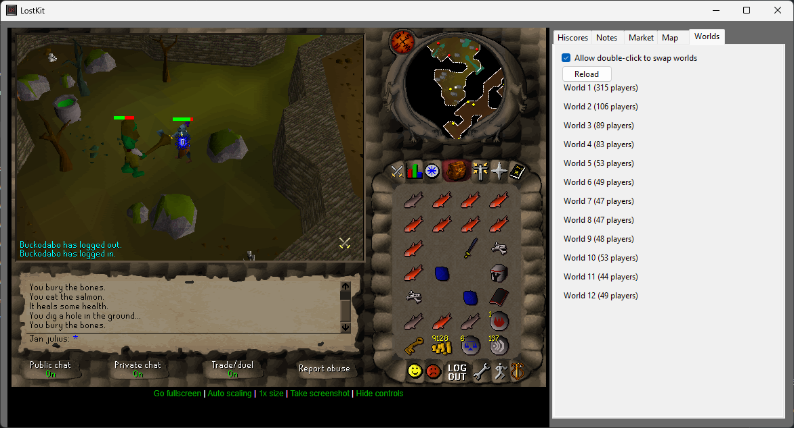

# LostKit

LostKit is an extension for Lost City (2004Scape) emulation and preservation project inspired by Swiftkit.

The application does not in any way interact with the game client.

Current functions:

* World map
* Market built in
* World switching from side panel
* Hiscore and adventure log lookup
* Notes
* True oldschool feel

